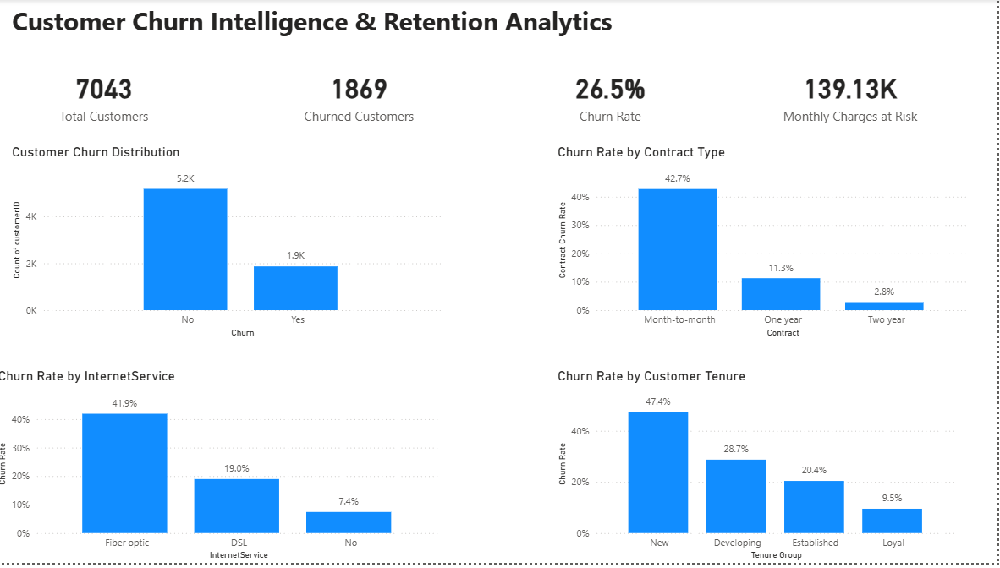
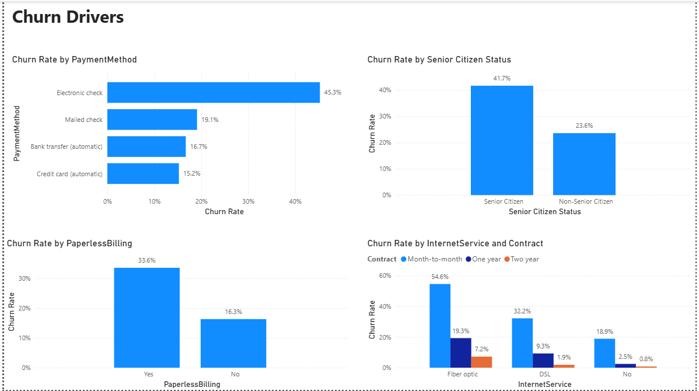
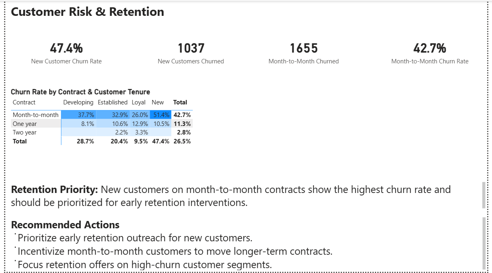

# Customer Churn Intelligence & Retention Analytics

**End-to-end customer analytics project using Python, SQL, Power BI, and Machine Learning to identify churn drivers, quantify revenue exposure, predict customer churn risk, and support retention strategy.**

---

## Project Overview

Customer churn directly impacts recurring revenue and customer lifetime value.

This project analyzes **7,043 telecom customers** to identify the customer characteristics and behaviors associated with churn, quantify the financial exposure linked to churned customers, and translate analytical findings into actionable retention strategies.

The analysis combines exploratory data analysis, SQL analytics, predictive modeling, and interactive business intelligence.

---

## Business Objectives

- Measure overall customer churn
- Identify high-churn customer segments
- Analyze the relationship between churn and customer tenure, contracts, services, and payment methods
- Quantify monthly billing associated with churned customers
- Identify customers who could be prioritized for retention
- Develop data-driven retention recommendations

---

## Executive Summary

| Metric | Result |
|---|---:|
| Total Customers | **7,043** |
| Churned Customers | **1,869** |
| Overall Churn Rate | **26.5%** |
| Monthly Charges Associated with Churned Customers | **$139,130.85** |
| Model ROC-AUC | **84.2%** |
| High-Risk Customers Identified | **93** |

### Highest-Churn Segments

| Segment | Churn Rate |
|---|---:|
| New Customers | **47.4%** |
| Electronic Check | **45.3%** |
| Month-to-Month Contract | **42.7%** |
| Fiber Optic Customers | **41.9%** |

---

## Key Business Insights

### Customer Tenure

Churn declines substantially as customer tenure increases.

- New customers: **47.4%**
- Developing customers: **28.7%**
- Established customers: **20.4%**
- Loyal customers: **9.5%**

### Contract Type

Longer-term contracts are associated with substantially lower churn.

- Month-to-month: **42.7%**
- One year: **11.3%**
- Two year: **2.8%**

### Customer Value

Customers who churned had higher average monthly charges than customers who stayed.

- Churned customers: **$74.44**
- Customers who stayed: **$61.27**

Customers who churned were associated with **$139,130.85 in monthly charges**, representing the monthly billing exposure associated with the churned customer group.

> This figure is a revenue exposure proxy based on observed monthly charges, not a forecast of future revenue loss.
---

## Predictive Modeling

A **Logistic Regression** model was developed to estimate the probability that a customer would churn.

### Model Performance

| Metric | Score |
|---|---:|
| Accuracy | **80.6%** |
| Churn Precision | **65.9%** |
| Churn Recall | **55.9%** |
| F1 Score | **60.5%** |
| ROC-AUC | **84.2%** |

Using a **70% churn-probability threshold**, the model identified **93 customers** in the test set as high-risk candidates for retention prioritization.

The model is intended to support business decision-making rather than automatically determine customer treatment.

### Key Predictive Signals

The model identified several features associated with higher or lower churn probability.

**Higher churn association:**
- Fiber optic internet service
- Electronic check payments
- Month-to-month contracts
- Streaming services
- Multiple-line phone service

**Lower churn association:**
- Two-year contracts
- One-year contracts
- Online security services
- Technical support
- Having dependents

> Model coefficients represent associations while controlling for other features in the model. They should not be interpreted as evidence of causation.

---

## Power BI Dashboard

The Power BI report translates the analysis into an interactive business intelligence solution across three pages.

### Executive Overview

Provides a high-level view of:

- Total customers
- Churned customers
- Overall churn rate
- Monthly charges associated with churned customers
- Churn by contract type
- Churn by tenure
- Churn by internet service



### Churn Drivers

Examines churn across key customer and service characteristics, including:

- Payment method
- Senior citizen status
- Paperless billing
- Internet service
- Internet service and contract combinations



### Customer Risk & Retention

Focuses on customer segments that require greater retention attention, including:

- New customer churn
- Month-to-month churn
- Contract and tenure combinations
- Retention priorities
- Recommended retention actions


---

## SQL Analysis

MySQL was used to independently analyze and validate the key findings from the Python analysis.

The SQL analysis covers:

- Churn distribution
- Churn by contract type
- Churn by customer tenure
- Churn by internet service
- Churn by payment method
- Monthly charges by churn status

**Database:** `customer_churn`  
**Environment:** MySQL Workbench

---

## Technology Stack

| Category | Technologies |
|---|---|
| Programming | Python |
| Data Analysis | Pandas, NumPy |
| Visualization | Matplotlib, Power BI |
| Database | MySQL |
| SQL | MySQL Workbench |
| Machine Learning | Scikit-learn |
| Development | Jupyter Notebook |
| Version Control | GitHub |

---

## Project Structure

```text
Customer-Churn-Intelligence/
│
├── data/
│   └── raw/
│       └── Telco-Customer-Churn.csv
│
├── notebooks/
│   └── 01.data_audit.ipynb
│
├── sql/
│   └── Customer_churn.sql
│
├── powerbi/
│   └── Customer Churn Intelligence Dashboard.pbix
│
├── reports/
│   ├── executive-overview.png
│   ├── churn-drivers.png
│   └── customer-risk-retention.png
│
└── README.md
```

---

## Data & Methodology

**Dataset:** IBM Telco Customer Churn benchmark dataset representing a fictional telecommunications company.

- Original dataset: **7,043 customer records**
- Duplicate customer IDs: **0**
- 11 records contained blank `TotalCharges` values
- The 11 blank-charge records had zero tenure and no recorded churn
- Python analysis retained all 7,043 records and treated the blank charges as zero
- MySQL contains 7,032 imported records because the 11 blank-charge records were excluded during import

### Analytical Considerations

- Churn findings represent **associations, not causation**
- Monthly charges associated with churned customers represent a **revenue exposure proxy**, not a forecast
- Predictive model results should support business judgment rather than automatically determine customer treatment

---

## Project Outcome

This project demonstrates an end-to-end analytics workflow connecting technical analysis with business decision-making.

The solution enables stakeholders to:

- Measure customer churn
- Identify high-risk customer segments
- Understand churn patterns
- Quantify monthly billing exposure
- Estimate individual churn risk
- Prioritize retention opportunities
- Translate analytical findings into actionable business recommendations

---

## Author

**Idah M. Musebe**

**Data Analyst | Data Engineer**

**Core Skills:**  
Python · SQL · MySQL · Power BI · Pandas · Machine Learning · Data Visualization · Business Intelligence
